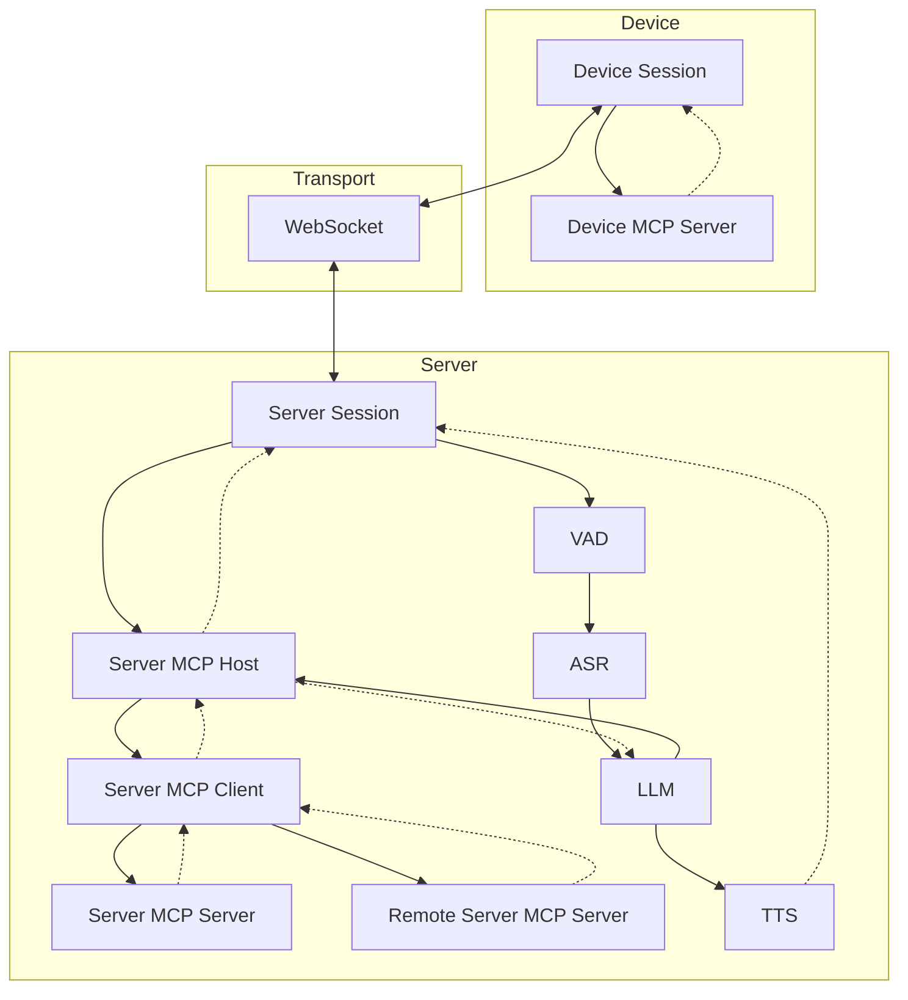
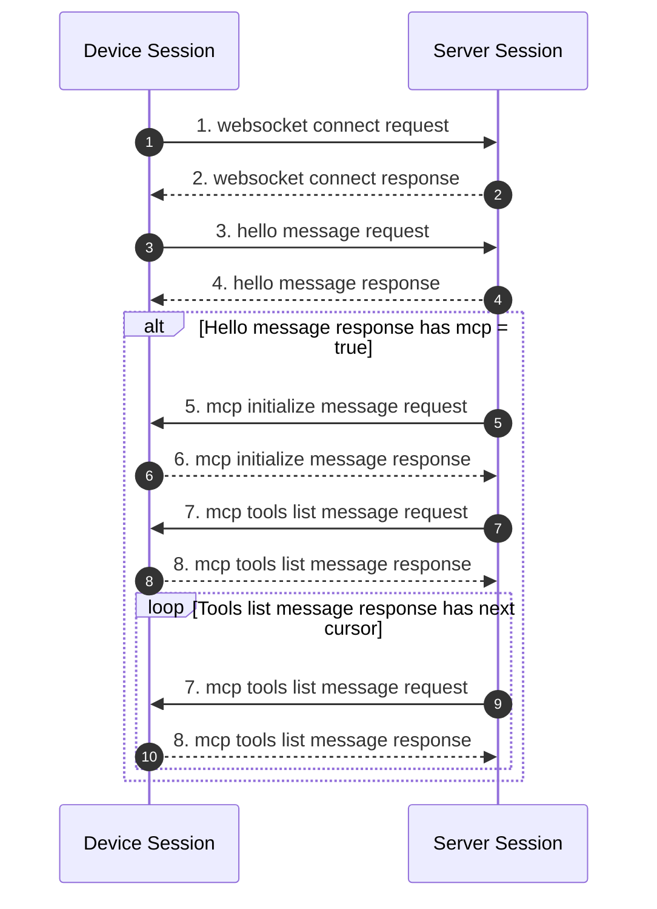
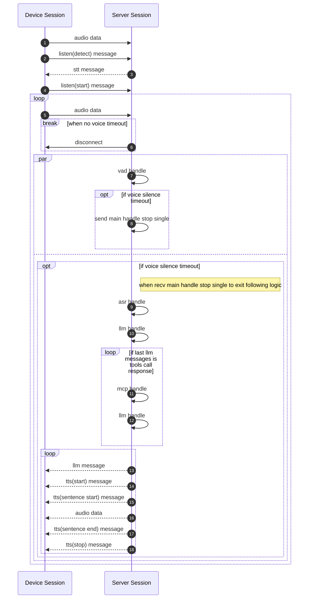
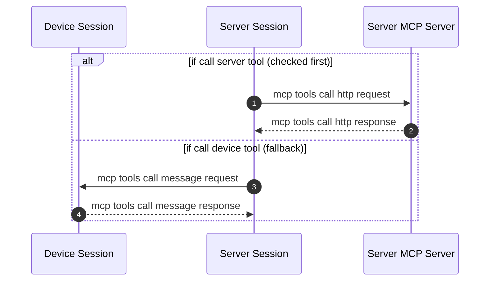

+++
title = "Dialogue Flow"
weight = 201
[extra]
source_file_hash = "aeb77229543cb70879ceee334f42737a866dad3b"
translated_at = "2026-08-31T00:00:00Z"
+++

# Dialogue Flow

### Handshake Phase

### Communication Phase

### Listen Modes

The listen mode is decided by the **`mode` field on the `listen(start)` frame** (`auto`/`manual`/`realtime`,
mapped to `barge_in` + `is_voice_break_detect`), not by a global Hello field. All three modes share the same
node chain (`opus→vad→asr→turn→ling→tts`); `auto`/`realtime` process frame-by-frame with streaming VAD + ASR (emitting live partials), while `manual` keeps pre-decoding via `ListenMode{streaming:false}` but suppresses emission until `listen(stop)`. See [VAD & Listener](@/development/debugging/vad-listener.en.md) for details.

#### Auto

The device continuously sends audio → the server automatically detects the end of speech (silence timeout) → triggers ASR + LLM processing. Suitable for hands-free conversation scenarios.

#### Manual

The device independently controls the start and end of audio transmission; the server starts receiving on `listen(start)`. **Manual never answers early**: while the button is held the ASR node keeps pouring frames into the stream to pre-decode (`ListenMode{streaming:false}` warm-up), but **suppresses partials and silence confirm** — no output at all; a final recognition (drain `FinishTurn` residual frames → `finish()`, near-instant) happens only when the device sends **`listen(stop)`** — i.e. "the server never jumps in, it waits for the device's `stop`". Pausing mid-hold does not trigger early either. Compared to a cold whole-clip decode after stop, warming spread the decode over the hold so recognition lands almost immediately on release. Suitable for push-to-talk scenarios.

If the button is pressed but no speech is captured (VAD detects no speech, the buffer is treated as silence), the hub classifies it as empty input (`EmptyKind::Manual`) and plays a guiding prompt once after `stop` (`Prompt{Manual, 1}` → LLM/Echo produces a "didn't catch that" utterance) to avoid silent no-response; **every keypress with no speech prompts once** (event-driven, not gated by Rule of three), then returns to listening-wait so the next keypress triggers again; see [Empty-Input Behavior](#empty-input-behavior) below.

#### Realtime

Low-latency mode. VAD detection directly triggers audio streaming without waiting for silence timeout before starting LLM inference and TTS streaming output. Suitable for real-time devices like ESP32.

### Empty-Input Behavior

Empty input (no valid speech) is classified and graded by the hub (Session) — `Wake`/`AutoSpoke`/`Silence`
follow Rule of three (max 3), while `Manual` is event-driven and prompts on every keypress; the generation
layer only renders wording. Classification is based on mode + previous turn (`EmptyKind`: `Manual` / `Wake` / `AutoSpoke` / `Silence` / `Continuing`).

| Scenario | kind | Behavior |
| --- | --- | --- |
| Push-to-talk no voice | `Manual` | plays 1 guiding prompt on each keypress ("didn't catch that, please repeat"), then back to listening-wait |
| No speech after wake word | `Wake` | guiding prompt ("what can I help you with?"), escalating, back to idle after 3 |
| Hands-free spoke but unclear | `AutoSpoke` | "didn't catch that, please repeat" → give example → graceful close |
| Hands-free total silence | `Silence` | gentle guide with no blame, escalating, back to idle after 3 |
| Continued listening after reply | `Continuing` | silent wait, no repeated prompting, back to idle on timeout |

A real LLM generates naturally from the act (`Prompt{kind, count}`); the Echo model returns a graded fixed sentence by kind/count.

### MCP Handle

Detailed protocol field definitions can be found in [WebSocket Protocol](@/development/server/websocket-protocol.en.md).
