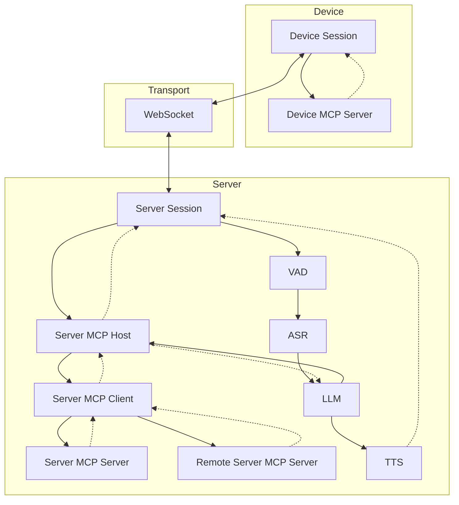
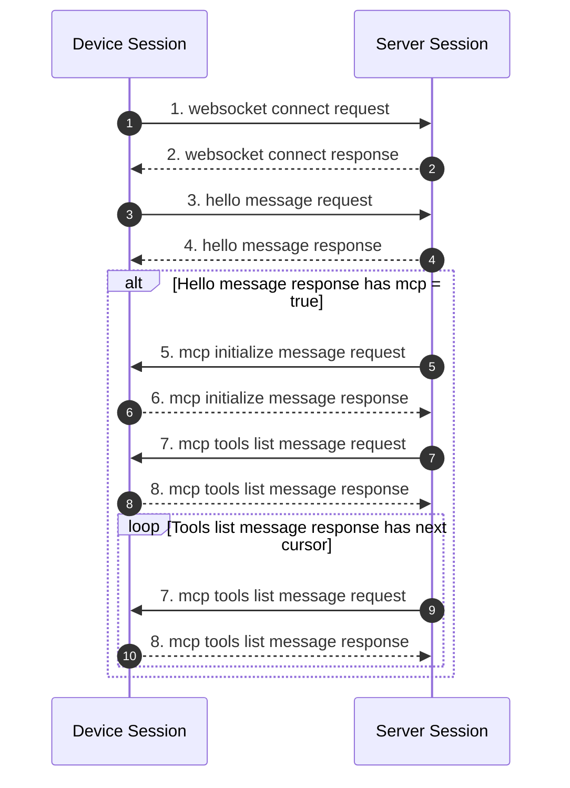
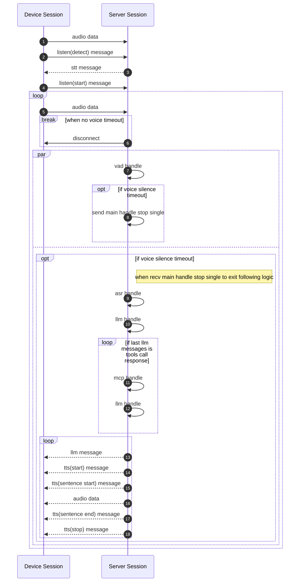
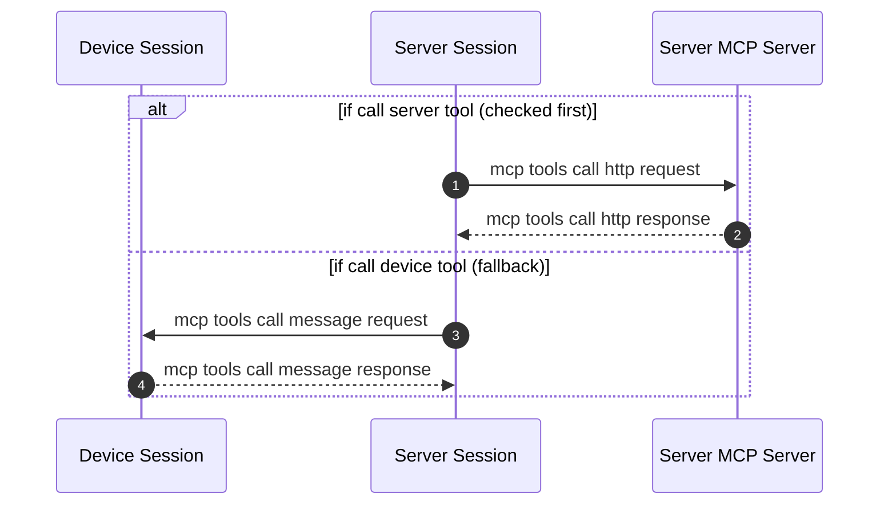

+++
title = "对话流程"
weight = 201
+++

# 对话流程

### 握手阶段

### 通讯阶段

### Listen mode

监听模式由 **`listen(start)` 帧的 `mode` 字段**决定（`auto`/`manual`/`realtime` 映射为
`barge_in` + `is_voice_break_detect`），并非来自 Hello 的全局字段。三种模式共用同一条节点链
（`opus→vad→asr→turn→ling→tts`）；`auto`/`realtime` 逐帧 VAD + 流式 ASR（实时 emit partial），`manual` 由
`ListenMode{streaming:false}` 保持喂流预解码但抑制发射，`listen(stop)` 时才成文。详见 [VAD & Listener](@/development/debugging/vad-listener.md)。

#### Auto

设备持续发送音频 → 服务器自动检测语音结束（静默超时）→ 触发 ASR + LLM 处理。适合免提对话场景。

#### Manual

设备独立控制语音发送的开始和结束，服务器收到 `listen(start)` 开始接收。**按键录音不抢答**：
ASR 节点按住期间仍逐帧喂流预解码（`ListenMode{streaming:false}` 暖管），但**抑制 partial 与静音确认**，
不产出任何结果；只有收到设备 **`listen(stop)`** 才成文识别（`FinishTurn` → 残留帧 `finish()`，近瞬返回），
即"服务器不抢答，一直等设备发 stop"；按住说话途中暂停同样不会提前触发。
比起冷启动整段识别，暖管把解码摊到按住期间，松开后识别几乎即时。

若按下但未采集到语音（VAD 未检测到任何语音，缓冲判定为无声），中枢判定为空输入（`EmptyKind::Manual`），
在 `stop` 后播一次引导提示语（`Prompt{Manual, 1}` → LLM/Echo 生成"没听清"表达），
避免静默无响应；**每次按键无人声都提示一次**（事件驱动，不受 Rule of three 限次），
提示后回到监听等待，下次按键再次触发；该提示由中枢辨别并分级，见下方 [空输入行为](#空输入行为)。

#### Realtime

低延迟模式，VAD 检测到语音后直接发送音频流，不等待静默超时即开始 LLM 推理和 TTS 流式输出。适合 ESP32 等实时设备。

### 空输入行为

空输入（无有效语音）由中枢（Session）辨别类型并分级提示（`Wake`/`AutoSpoke`/`Silence` 遵循
Rule of three 最多 3 次；`Manual` 事件驱动每次按键都提示），生成层只渲染文案。
判别依据：模式 + 前一 turn（`EmptyKind`: `Manual` / `Wake` / `AutoSpoke` / `Silence` / `Continuing`）。

| 场景 | kind | 行为 |
| --- | --- | --- |
| 按键无人声 | `Manual` | 每次按键播 1 次引导提示（"没听到，请再说"），之后回监听等待 |
| 唤醒词后未说话 | `Wake` | 引导式提示（"想让我帮你做什么？"），逐次升级，3 次回 idle |
| 免提说了但没听清 | `AutoSpoke` | "没听清，请重说" → 给示例 → 优雅收尾 |
| 免提完全静默 | `Silence` | 温柔引导不指责，逐次升级，3 次回 idle |
| 回复后连续监听 | `Continuing` | 静默等待，不反复提示，超时回 idle |

真实 LLM 按 Act（`Prompt{kind, count}`）自然生成；Echo 模型按 kind/count 返回分级固定句。

### MCP handle

详细的协议字段定义见 [WebSocket Protocol](@/development/server/websocket-protocol.md)。
